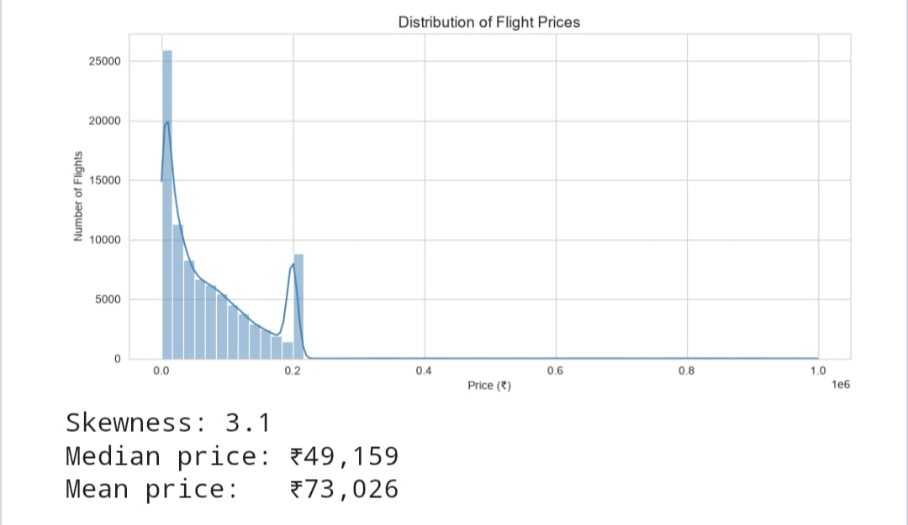
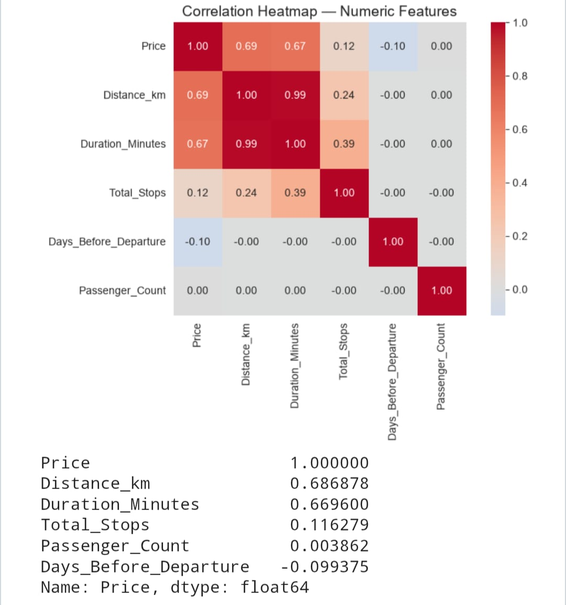

# AI Travel Analyst — Flight Price Analysis

**MIC AIML Department Recruitment Challenge — Data Science & Visualization Track (Part 1)**

## Project Overview

An exploratory data analysis of a flight pricing dataset, aimed at understanding what
actually drives ticket prices and turning that into practical, traveler-facing
recommendations. The project covers the full Part 1 pipeline: cleaning a messy
real-world-style dataset, engineering useful features, building meaningful
visualizations, and translating chart patterns into ranked insights.

## Problem Statement

Given a raw flight pricing dataset with realistic messiness — inconsistent category
labels, mixed units, missing values, and duplicate rows — clean it into an
analysis-ready form, engineer features that make analysis possible, and identify which
factors most influence flight price. The end goal is to help a traveler understand
*what actually matters* when booking a flight, not just describe the dataset.


Then open and run, in order:
1. `solution.ipynb` (or `day1_data_prep_eda.ipynb`) — cleaning, feature engineering, early EDA
2. `day2_visualization_insights.ipynb` — visualizations, insights, recommendations

Run each notebook top to bottom (Restart Kernel → Run All) rather than executing cells
out of order, since later cells depend on earlier ones.

## Dataset Used

- **Raw:** `flight_pricing_dataset.csv` — 100,000 rows, 18 columns, deliberately messy
  (mixed category encodings, inconsistent units, missing values, duplicates)
- **Cleaned:** `flight_pricing_cleaned.csv` — 90,258 rows, 19 columns, output of Day 1

Columns include: airline, source/destination, departure date & time, duration, number
of stops, distance, travel class, days before departure, season, weekday, aircraft
type, booking channel, passenger count, and price (the target variable).

## Methodology

**Day 1 — Cleaning & Feature Engineering**

- Inspected the raw data: found ~5% missing values scattered across every column,
  ~2,000 duplicate rows, and every column stored as text regardless of true type
- Standardized inconsistent category labels: airline casing (`VISTARA` / `Vistara` →
  one form), city naming (`Mumbai` / `BOM` / `Mumbai Airport` → one form), and
  stop-count formats (`non-stop` / `0` → `0`)
- Cleaned `Price` (stripped `Rs.` prefix and thousands separators) and
  `Passenger_Count` (word numerals like `"three"` → `3`)
- Converted columns to correct dtypes and parsed `Departure_Date` into a real datetime
- Wrote a custom parser to unify three different `Duration` formats (`"3h 11m"`,
  `"177 min"`, and decimal hours) into a single `Duration_Minutes` column
- Filled remaining missing values: median for numeric columns, `"Unknown"` for
  categorical/text columns, dropped rows missing the target `Price`
- Ran an early rough pass on price by airline, class, and stops

**Day 2 — Visualization & Insights**

- Built 6 visualizations, each targeting a specific question about price
- Wrote insight bullets under every chart explaining what the pattern means
- Consolidated findings into a ranked list of major price-driving factors
- Wrote traveler-facing recommendations and explicit caveats about confounded variables

## Technologies Used

Python, pandas, numpy, matplotlib, seaborn, Jupyter Notebook, Git/GitHub.

## Results

**Visualizations built (6):**
1. Price distribution (histogram + KDE)
2. Price by Airline (boxplot)
3. Price by Number of Stops (boxplot)
4. Price vs Days Before Departure (scatter + trend line)
5. Correlation heatmap across all numeric features
6. Price by Travel Class (boxplot — stretch chart)

**Major factors affecting price, ranked by effect size:**

1. **Travel Class** — the strongest, cleanest driver; Business/First cost several
   times Economy with minimal overlap between classes
2. **Distance / Duration** — the strongest continuous predictors (correlation ≈ 0.65–0.69
   with price); longer flights cost more, and the two are highly correlated with
   each other
3. **Total Stops** — weakly positively correlated with price (≈ 0.11–0.12), most
   likely because more stops track longer routes rather than layovers directly
   increasing cost
4. **Airline** — matters, but largely reflects route type (international full-service
   vs domestic budget carriers) rather than pure brand pricing power
5. **Days Before Departure** — only a weak effect (≈ −0.10 correlation); booking
   early saves little in this dataset, contrary to popular assumption

**Recommendations for travelers:**
- Prioritize route and cabin class over trying to time the booking window precisely
- Don't over-optimize "days before departure" — the price difference between booking
  60 days out vs 20 days out is marginal in this data
- Don't assume a connecting flight is automatically cheaper than non-stop — stops
  track distance more than they track a "convenience premium" here
- Compare prices using the median, not the mean, since the price distribution is
  right-skewed by a smaller number of expensive fares

## Challenges Faced

- **Inconsistent real-world-style encodings:** the same city could appear as its
  name, its airport code, or "`<city> Airport`" — required a manual mapping rather
  than a simple string transform
- **Three incompatible `Duration` formats** in a single column (`"3h 11m"`,
  `"177 min"`, decimal hours) needed a custom regex-based parser instead of a
  built-in pandas conversion
- **Missing-value handling was easy to under-cover:** columns derived from
  `Departure_Date` (`Departure_Month`, `Departure_Day`) inherited missing values
  whenever the source date failed to parse, which wasn't obvious until explicitly
  checking `isnull().sum()` after every transformation step — a good reminder to
  verify assumptions with code rather than trust that a fix "should" have worked
- **Confounded factors:** Distance, Duration, and Total_Stops are correlated with
  each other, which limits how confidently any single factor can be called causal
  rather than merely correlated — addressed by stating this explicitly rather than
  overclaiming

## Future Improvements

- Engineer a route-type feature (domestic vs international) to help disentangle
  Distance/Stops/Airline effects from one another
- Build a simple price-prediction regression model as a natural extension beyond
  Part 1's exploratory scope
- Add interactive filtering (e.g. a Streamlit app) so a traveler could explore price
  patterns for their own specific route and travel dates

## Screenshots

*(Add 2-3 screenshots of your favorite charts here before submitting, e.g. the
correlation heatmap and the price-by-class boxplot — makes the README easier to skim
without opening the notebook)*

```markdown







```

## Demo Video

*(Link here — 3–5 min walkthrough covering: problem statement → cleaning approach →
each visualization + its insight → key recommendations)*

